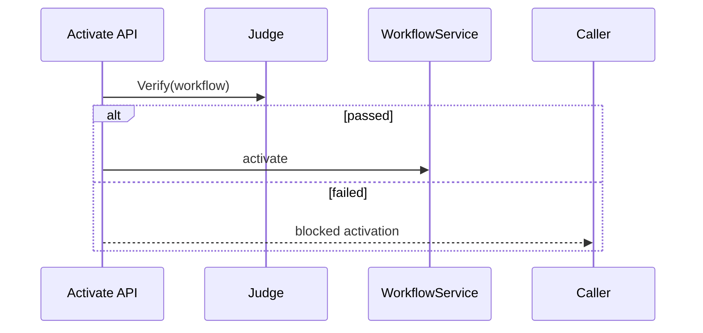
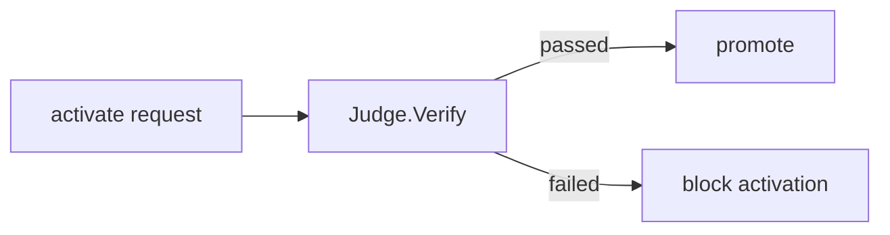
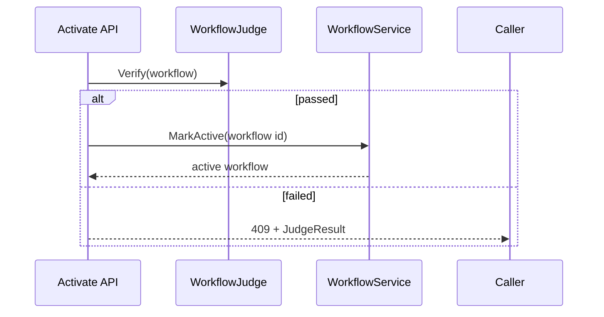

# Task F5.10 - Re-Verify on Activate

**Status**: Completed
**Phase**: AGENT_SPEC - Fase 5 Judge y activacion
**Depends on**: F5.3, F5.9
**Required by**: F5.11, F5.12

---

## Objective

Re-verificar el workflow durante `activate` antes de promover la version.

---

## Scope

1. ejecutar `Judge.Verify` en activate
2. bloquear promotion si verify falla
3. evitar drift entre verify y activate
4. devolver findings consistentes

---

## Out of Scope

- checks avanzados adicionales a los de `Judge.Verify`

---

## Acceptance Criteria

- activate re-ejecuta verify
- no se activa si verify falla
- el flujo usa el mismo Judge que el endpoint `verify`

---

## Diagram



## Quality Gates

```powershell
go test ./internal/domain/agent/...
go test ./internal/api/handlers/... ./internal/api/middleware/...
```

## References

- `docs/agent-spec-phase5-analysis.md`
- `docs/agent-spec-design.md`

## Sources of Truth

- `docs/agent-spec-overview.md`
- `docs/agent-spec-development-plan.md`
- `docs/agent-spec-design.md`
- `docs/agent-spec-use-cases.md`
- `docs/agent-spec-traceability.md`
- `docs/agent-spec-phase5-analysis.md`

## Planned Diagram



## Planned Deliverable

- activate path guarded by Judge
- tests proving stale or broken DSL cannot be activated

## Implementation References

- `internal/domain/agent/`
- `internal/api/handlers/`
- `internal/domain/workflow/`
- `internal/api/handlers/workflow.go`
- `internal/api/handlers/workflow_test.go`

## Verification Evidence

- `go test ./internal/domain/agent/...`
- `go test ./internal/api/handlers/... ./internal/api/middleware/...`

## Implemented Diagram



## Implemented

- `activate` now re-runs `Judge.Verify(...)` before promotion
- activation is blocked when verification returns `passed=false`
- blocked activation returns `409` plus the `JudgeResult`
- successful activation still requires `status=testing`
- the same `WorkflowJudge` implementation is used by both `verify` and `activate`
