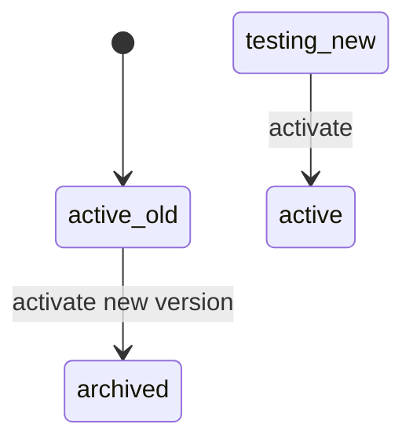
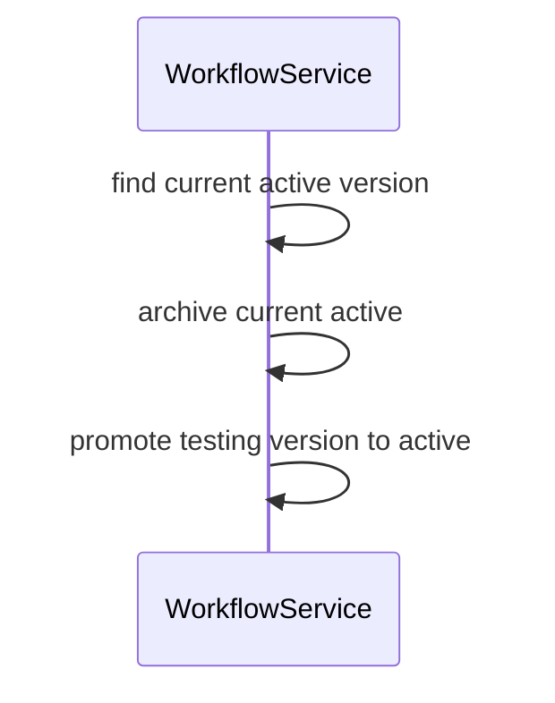
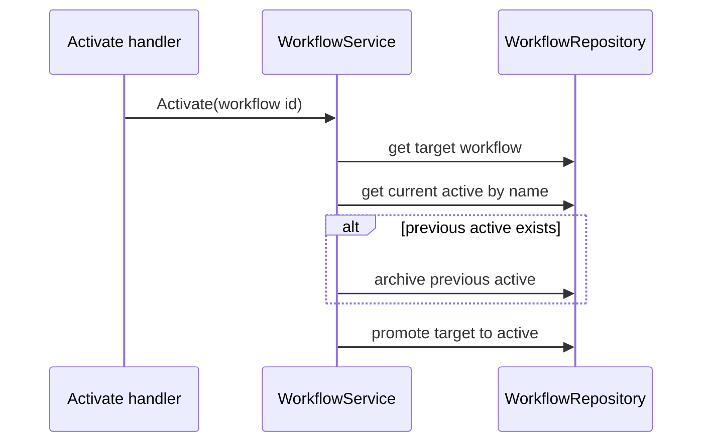

# Task F5.11 - Archive Previous Active Workflow

**Status**: Completed
**Phase**: AGENT_SPEC - Fase 5 Judge y activacion
**Depends on**: F5.9, F5.10
**Required by**: F7.6

---

## Objective

Archivar la version activa anterior al activar una nueva.

---

## Scope

1. localizar workflow activo previo por `workspace + name`
2. archivarlo antes o durante promotion segura
3. mantener una sola version activa
4. preservar trazabilidad de version chain

---

## Out of Scope

- rollback automatico
- historial visual de versiones

---

## Acceptance Criteria

- al activar una nueva version, la activa previa queda `archived`
- se mantiene la unicidad de workflow activo
- el cambio no rompe rollback futuro

---

## Diagram



## Quality Gates

```powershell
go test ./internal/domain/workflow/...
go test ./internal/api/handlers/... ./internal/api/middleware/...
```

## References

- `docs/agent-spec-phase5-analysis.md`
- `docs/agent-spec-design.md`

## Sources of Truth

- `docs/agent-spec-overview.md`
- `docs/agent-spec-development-plan.md`
- `docs/agent-spec-design.md`
- `docs/agent-spec-use-cases.md`
- `docs/agent-spec-traceability.md`
- `docs/agent-spec-phase5-analysis.md`

## Planned Diagram



## Planned Deliverable

- safe active version swap
- tests for prior-active archival on promotion

## Implementation References

- `internal/domain/workflow/`
- `internal/api/handlers/`
- `internal/domain/workflow/service.go`
- `internal/domain/workflow/service_test.go`
- `internal/api/handlers/workflow.go`

## Verification Evidence

- `go test ./internal/domain/workflow/...`
- `go test ./internal/api/handlers/... ./internal/api/middleware/...`

## Implemented Diagram



## Implemented

- activation swap now lives in `WorkflowService.Activate(...)`
- if another active workflow exists for the same `workspace + name`, it is archived first
- the target testing workflow is then promoted to `active`
- handler activation now delegates to `Activate(...)` instead of direct `MarkActive(...)`
