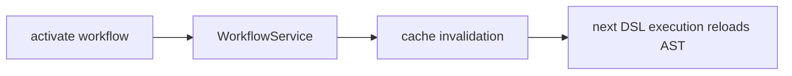
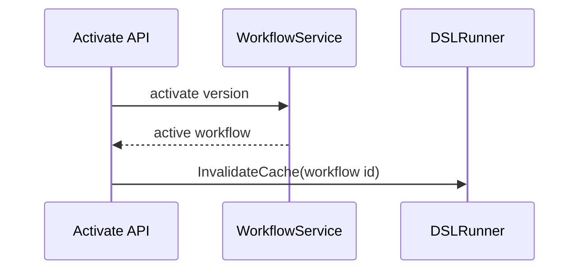
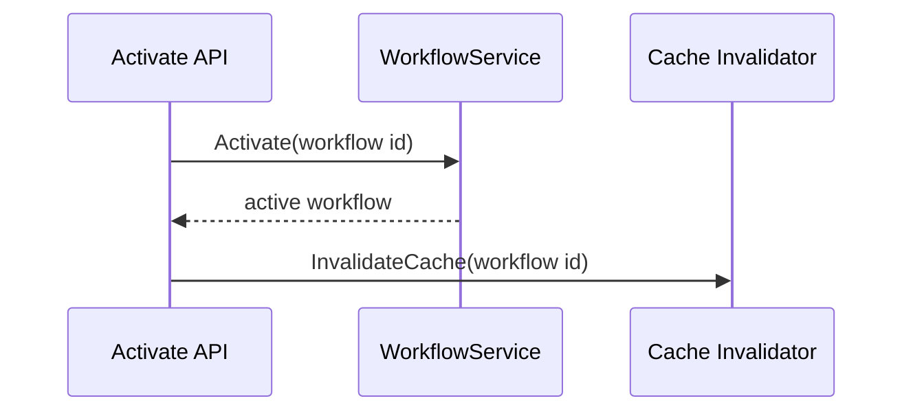

# Task F5.12 - Invalidate AST Cache on Activate

**Status**: Completed
**Phase**: AGENT_SPEC - Fase 5 Judge y activacion
**Depends on**: F4.11, F5.9, F5.10
**Required by**: F7.3

---

## Objective

Invalidar la cache de AST del `DSLRunner` al activar una version.

---

## Scope

1. limpiar cache del workflow activado
2. evitar reutilizacion de AST viejo
3. integrar invalidacion en activate
4. dejar comportamiento determinista tras promotion

---

## Out of Scope

- eviction strategy avanzada
- cache distribuida

---

## Acceptance Criteria

- activate invalida cache AST relevante
- la siguiente ejecucion recompone AST desde el workflow activo
- existe test contra stale cache

---

## Diagram



## Quality Gates

```powershell
go test ./internal/domain/agent/...
go test ./internal/domain/workflow/...
```

## References

- `docs/agent-spec-phase5-analysis.md`
- `docs/agent-spec-design.md`

## Sources of Truth

- `docs/agent-spec-overview.md`
- `docs/agent-spec-development-plan.md`
- `docs/agent-spec-design.md`
- `docs/agent-spec-use-cases.md`
- `docs/agent-spec-traceability.md`
- `docs/agent-spec-phase5-analysis.md`

## Planned Diagram



## Planned Deliverable

- AST cache invalidation integrated into activate flow
- regression test for stale-cache avoidance

## Implementation References

- `internal/domain/agent/dsl_runner.go`
- `internal/domain/workflow/`
- `internal/api/handlers/`
- `internal/api/handlers/workflow.go`
- `internal/api/handlers/workflow_test.go`

## Verification Evidence

- `go test ./internal/domain/agent/...`
- `go test ./internal/domain/workflow/...`

## Implemented Diagram



## Implemented

- activate path now invalidates the shared DSL AST cache after successful promotion
- cache invalidation reuses the existing `workflowCacheInvalidator` hook
- failed activation does not invalidate cache
- the target workflow id is used as the invalidation key
