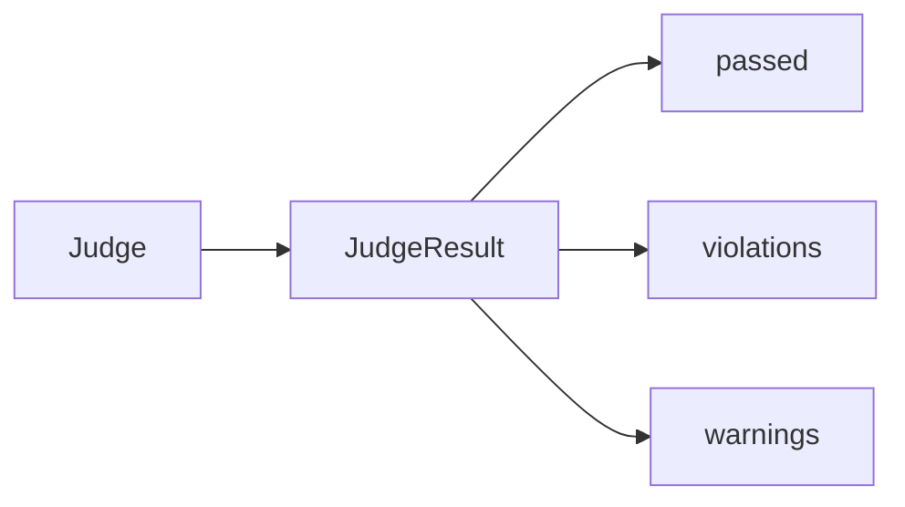
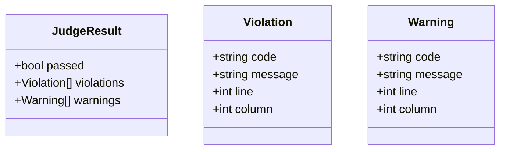
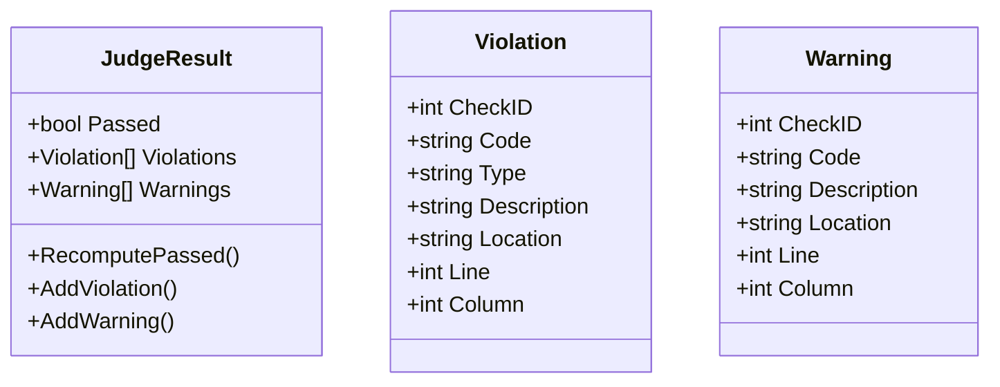

# Task F5.2 - Judge Result Model

**Status**: Completed
**Phase**: AGENT_SPEC - Fase 5 Judge y activacion
**Depends on**: F5.1
**Required by**: F5.3, F5.7, F5.9

---

## Objective

Implementar la estructura de `JudgeResult`, `Violation` y `Warning`.

---

## Scope

1. definir resultado canonico del Judge
2. distinguir `violations` de `warnings`
3. soportar posicion, codigo y mensaje
4. dejar contrato estable para API y activate

---

## Out of Scope

- logica de verificacion
- parser de spec
- endpoints

---

## Acceptance Criteria

- existe un modelo estable de resultado del Judge
- `passed` depende de `violations`, no de `warnings`
- `Violation` y `Warning` soportan metadata util para debugging
- el contrato es reutilizable por verify y activate

---

## Diagram



## Quality Gates

```powershell
go test ./internal/domain/agent/...
```

## References

- `docs/agent-spec-phase5-analysis.md`
- `docs/agent-spec-design.md`

## Sources of Truth

- `docs/agent-spec-overview.md`
- `docs/agent-spec-development-plan.md`
- `docs/agent-spec-design.md`
- `docs/agent-spec-use-cases.md`
- `docs/agent-spec-traceability.md`
- `docs/agent-spec-phase5-analysis.md`

## Planned Diagram



## Planned Deliverable

- reusable Judge result types
- explicit severity split between blocking and non-blocking findings
- tests for `passed` semantics and result serialization

## Implementation References

- `internal/domain/agent/`

## Verification Evidence

- `go test ./internal/domain/agent/...`

## Implemented Diagram



## Implemented

- canonical Judge model added with:
  - `JudgeResult`
  - `Violation`
  - `Warning`
- `Passed` semantics centralized around presence or absence of `Violations`
- helper methods added for:
  - construction
  - normalization
  - `Passed` recomputation
  - incremental addition of violations and warnings
- `F5.1` syntax gate now emits canonical `Violation` values instead of a parallel custom shape
