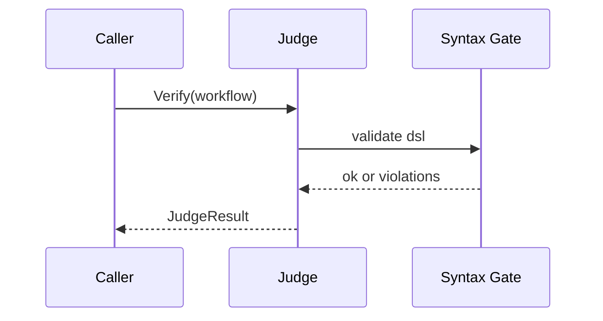
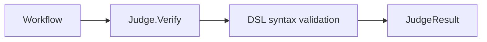
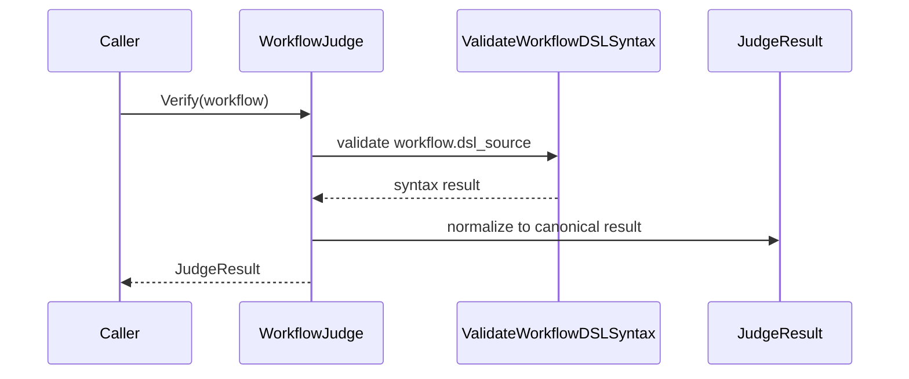

# Task F5.3 - Judge.Verify

**Status**: Completed
**Phase**: AGENT_SPEC - Fase 5 Judge y activacion
**Depends on**: F5.1, F5.2
**Required by**: F5.4, F5.6, F5.7, F5.10

---

## Objective

Implementar `Judge.Verify` como entry point unico de verificacion.

---

## Scope

1. cargar workflow
2. ejecutar gate sintactico DSL
3. poblar `JudgeResult`
4. devolver `passed`, `violations` y `warnings`

---

## Out of Scope

- parser parcial de spec
- consistency checks profundos
- endpoints HTTP

---

## Acceptance Criteria

- existe `Judge.Verify`
- usa F5.1 y F5.2 como base
- workflows con DSL invalido retornan `passed=false`
- sirve como contrato comun para verify y activate

---

## Diagram



## Quality Gates

```powershell
go test ./internal/domain/agent/...
go test ./internal/domain/workflow/...
```

## References

- `docs/agent-spec-phase5-analysis.md`
- `docs/agent-spec-design.md`

## Sources of Truth

- `docs/agent-spec-overview.md`
- `docs/agent-spec-development-plan.md`
- `docs/agent-spec-design.md`
- `docs/agent-spec-use-cases.md`
- `docs/agent-spec-traceability.md`
- `docs/agent-spec-phase5-analysis.md`

## Planned Diagram



## Planned Deliverable

- `Judge` interface implementation
- consistent verification contract across service and API
- tests for success and syntax failure paths

## Implementation References

- `internal/domain/agent/`
- `internal/domain/workflow/`
- `internal/domain/agent/judge.go`
- `internal/domain/agent/judge_test.go`

## Verification Evidence

- `go test ./internal/domain/agent/...`
- `go test ./internal/domain/workflow/...`

## Implemented Diagram



## Implemented

- `WorkflowJudge` added as the first concrete `Judge` implementation
- `Judge.Verify(...)` now acts as the single verification entry point
- current verification scope is intentionally limited to DSL syntax and DSL v0 validation
- verification result is normalized to the canonical `JudgeResult`
- no `spec_source` parsing or spec-to-DSL consistency checks are performed yet; that remains for later Fase 5 tasks
