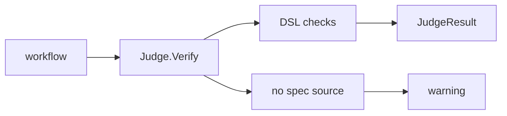
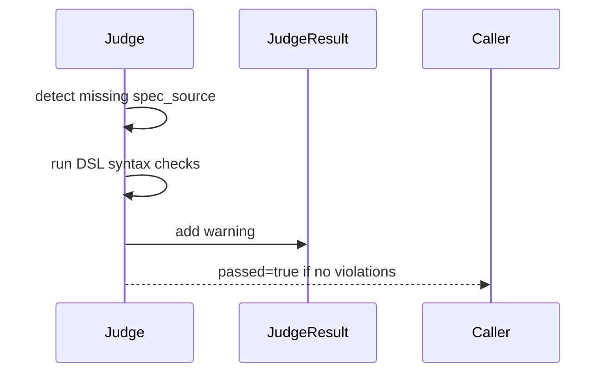
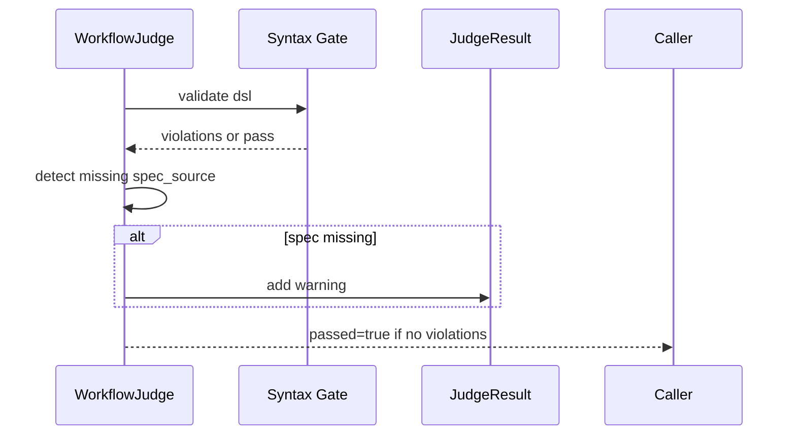

# Task F5.4 - Verify Without Spec Source

**Status**: Completed
**Phase**: AGENT_SPEC - Fase 5 Judge y activacion
**Depends on**: F5.3
**Required by**: F5.7, F5.9

---

## Objective

Permitir verify cuando `spec_source` no existe, devolviendo warnings en lugar de bloquear.

---

## Scope

1. detectar ausencia de `spec_source`
2. mantener checks sintacticos del DSL
3. emitir warnings no bloqueantes
4. preservar `passed=true` si no hay violations

---

## Out of Scope

- parsing parcial de spec
- consistency checks `spec -> DSL`

---

## Acceptance Criteria

- verify funciona sin `spec_source`
- se genera warning explicito
- no se bloquea si el DSL es sintacticamente valido

---

## Diagram



## Quality Gates

```powershell
go test ./internal/domain/agent/...
```

## References

- `docs/agent-spec-phase5-analysis.md`
- `docs/agent-spec-use-cases.md`

## Sources of Truth

- `docs/agent-spec-overview.md`
- `docs/agent-spec-development-plan.md`
- `docs/agent-spec-design.md`
- `docs/agent-spec-use-cases.md`
- `docs/agent-spec-traceability.md`
- `docs/agent-spec-phase5-analysis.md`

## Planned Diagram



## Planned Deliverable

- warning path for spec-less workflows
- tests for verify with missing spec source

## Implementation References

- `internal/domain/agent/`
- `internal/domain/agent/judge.go`
- `internal/domain/agent/judge_test.go`

## Verification Evidence

- `go test ./internal/domain/agent/...`

## Implemented Diagram



## Implemented

- `Judge.Verify(...)` now detects missing or blank `spec_source`
- when `spec_source` is absent, the Judge adds a non-blocking warning:
  - `missing_spec_source`
- DSL syntax validation still runs normally
- valid DSL without spec now returns `passed=true` plus warning
- invalid DSL without spec returns `passed=false` plus syntax violation and warning
