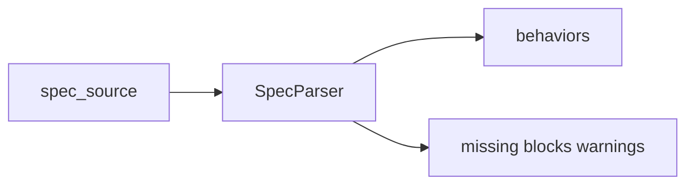
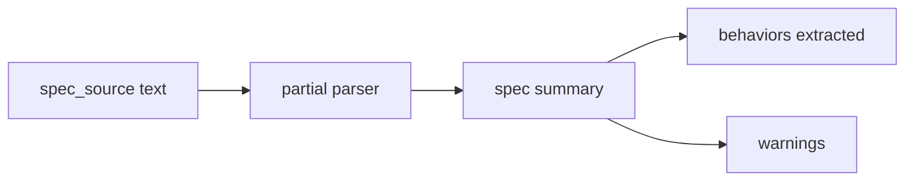
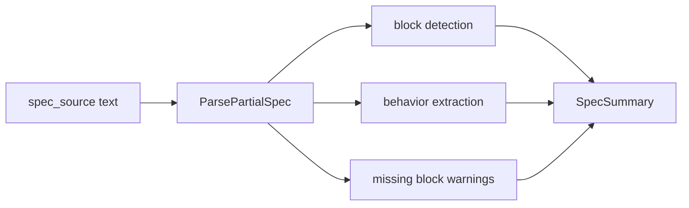

# Task F5.5 - Partial Spec Parser

**Status**: Completed
**Phase**: AGENT_SPEC - Fase 5 Judge y activacion
**Depends on**: F2.3
**Required by**: F5.6

---

## Objective

Implementar parser parcial de `spec_source` para habilitar checks iniciales del Judge.

---

## Scope

1. parsear bloques minimos de spec
2. extraer `BEHAVIOR` y estructura relevante
3. tolerar spec incompleto con warnings
4. dejar salida estable para consistency checks

---

## Out of Scope

- parser completo del spec
- checks avanzados de ambiguedad

---

## Acceptance Criteria

- existe parser parcial usable por el Judge
- soporta al menos `BEHAVIOR`
- spec incompleto no rompe el proceso, pero genera warnings

---

## Diagram



## Quality Gates

```powershell
go test ./internal/domain/agent/...
```

## References

- `docs/agent-spec-phase5-analysis.md`
- `docs/agent-spec-design.md`

## Sources of Truth

- `docs/agent-spec-overview.md`
- `docs/agent-spec-development-plan.md`
- `docs/agent-spec-design.md`
- `docs/agent-spec-use-cases.md`
- `docs/agent-spec-traceability.md`
- `docs/agent-spec-phase5-analysis.md`

## Planned Diagram



## Planned Deliverable

- minimal spec parser focused on verification use cases
- warnings for missing sections instead of hard failures

## Implementation References

- `internal/domain/agent/`
- `internal/domain/agent/spec_parser.go`
- `internal/domain/agent/spec_parser_test.go`

## Verification Evidence

- `go test ./internal/domain/agent/...`

## Implemented Diagram



## Implemented

- partial parser `ParsePartialSpec(...)` added
- extracts known blocks:
  - `CONTEXT`
  - `ACTORS`
  - `BEHAVIOR`
  - `CONSTRAINTS`
- extracts `BEHAVIOR <name>` entries with source line
- emits non-blocking warning `spec_missing_blocks` when expected blocks are absent
- empty spec returns an empty summary without failing the parse path
