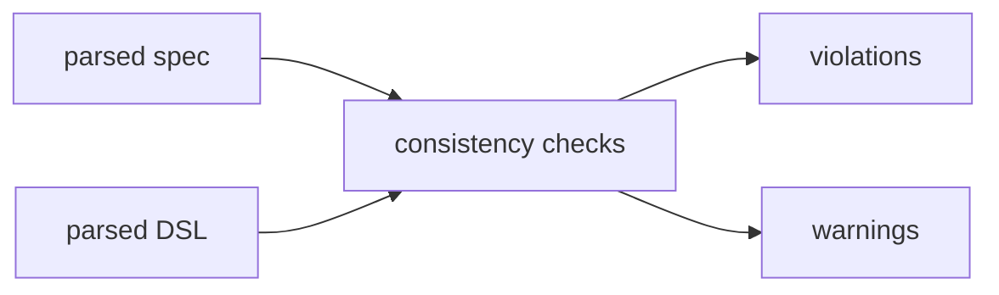
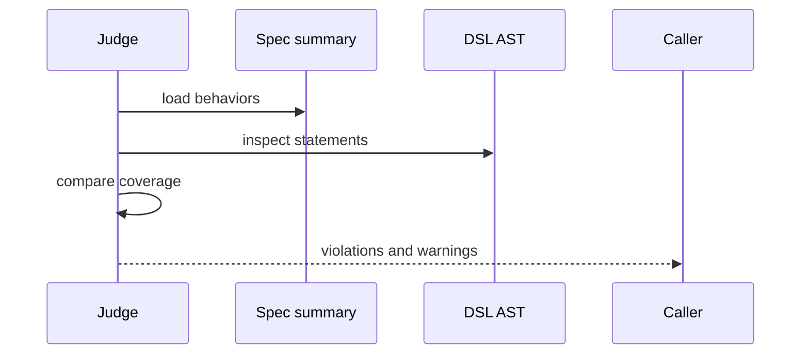
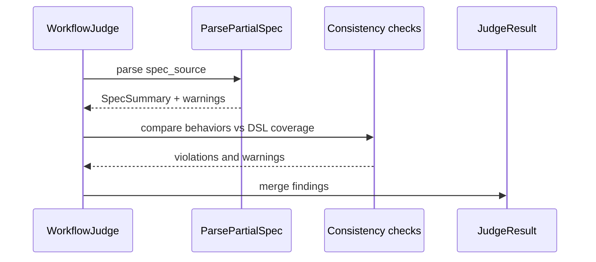

# Task F5.6 - Initial Spec to DSL Consistency Checks

**Status**: Completed
**Phase**: AGENT_SPEC - Fase 5 Judge y activacion
**Depends on**: F5.3, F5.5
**Required by**: F5.7, F5.9

---

## Objective

Implementar checks iniciales de consistencia entre `spec_source` y `dsl_source`.

---

## Scope

1. mapear behaviors del spec a cobertura DSL
2. detectar verbos desconocidos o faltantes
3. producir violations y warnings consistentes
4. integrarlo en `Judge.Verify`

---

## Out of Scope

- checks avanzados de ambiguedad
- semantica profunda de negocio

---

## Acceptance Criteria

- Judge detecta ausencia de cobertura basica de behaviors
- unknown verbs o estructuras incompatibles generan findings
- resultado queda integrado en `JudgeResult`

---

## Diagram



## Quality Gates

```powershell
go test ./internal/domain/agent/...
```

## References

- `docs/agent-spec-phase5-analysis.md`
- `docs/agent-spec-use-cases.md`

## Sources of Truth

- `docs/agent-spec-overview.md`
- `docs/agent-spec-development-plan.md`
- `docs/agent-spec-design.md`
- `docs/agent-spec-use-cases.md`
- `docs/agent-spec-traceability.md`
- `docs/agent-spec-phase5-analysis.md`

## Planned Diagram



## Planned Deliverable

- first consistency checks integrated into Judge
- tests for matching and mismatching spec/DSL pairs

## Implementation References

- `internal/domain/agent/`
- `internal/domain/agent/judge_consistency.go`
- `internal/domain/agent/judge_consistency_test.go`
- `internal/domain/agent/judge.go`
- `internal/domain/agent/judge_test.go`

## Verification Evidence

- `go test ./internal/domain/agent/...`

## Implemented Diagram



## Implemented

- initial consistency checks added between `spec_source` and parsed DSL
- `ParsePartialSpec(...)` warnings are now merged into `JudgeResult`
- behavior coverage check added with `CheckID=5`
- coverage uses a basic DSL summary built from:
  - workflow name
  - trigger event
  - `SET` targets
  - `NOTIFY` targets
  - `AGENT` names
- uncovered behaviors now produce `behavior_no_coverage`
- checks only run when syntax passes and `spec_source` exists
