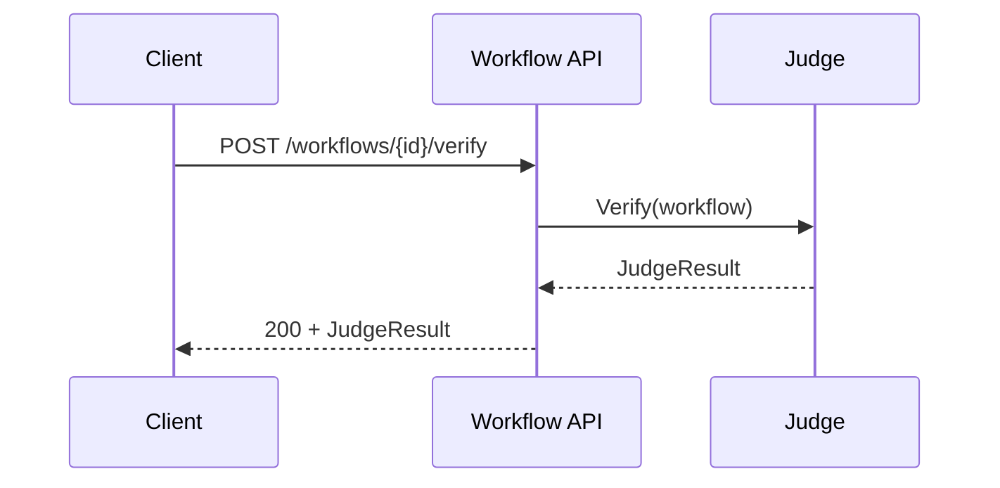
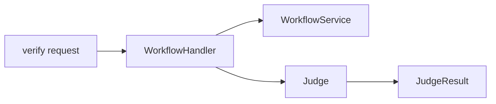
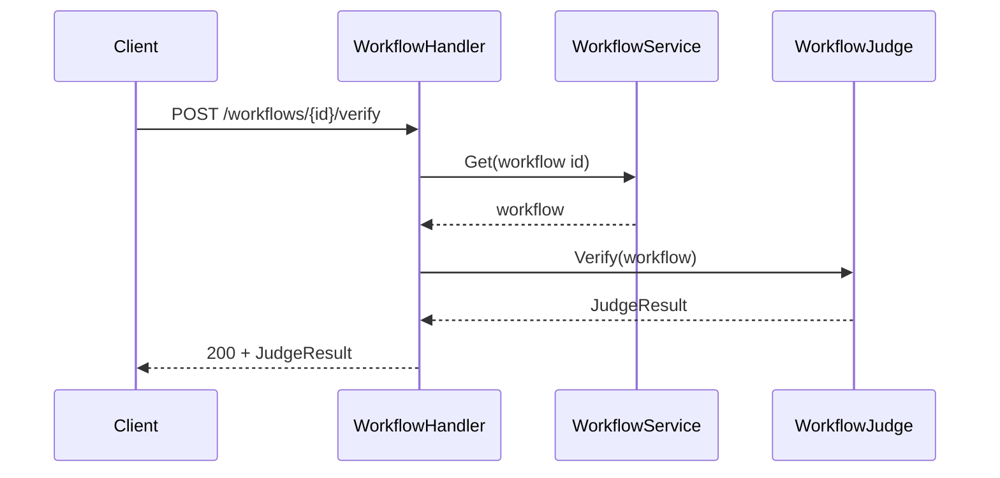

# Task F5.7 - Verify Workflow Endpoint

**Status**: Completed
**Phase**: AGENT_SPEC - Fase 5 Judge y activacion
**Depends on**: F5.3, F5.6
**Required by**: F5.8, F5.9

---

## Objective

Implementar `POST /api/v1/workflows/{id}/verify`.

---

## Scope

1. exponer verify por API
2. cargar workflow por id
3. ejecutar `Judge.Verify`
4. devolver `JudgeResult`

---

## Out of Scope

- activate
- archive de versiones
- scheduler

---

## Acceptance Criteria

- existe endpoint de verify
- responde `200` con `JudgeResult`
- no trata violations como error tecnico
- diferencia claramente workflow inexistente de verify fallido

---

## Diagram



## Quality Gates

```powershell
go test ./internal/api/handlers/... ./internal/api/middleware/...
go test ./internal/domain/agent/...
```

## References

- `docs/agent-spec-phase5-analysis.md`
- `docs/agent-spec-design.md`

## Sources of Truth

- `docs/agent-spec-overview.md`
- `docs/agent-spec-development-plan.md`
- `docs/agent-spec-design.md`
- `docs/agent-spec-use-cases.md`
- `docs/agent-spec-traceability.md`
- `docs/agent-spec-phase5-analysis.md`

## Planned Diagram



## Planned Deliverable

- HTTP endpoint for verify
- API tests for success, missing workflow, and verify with violations

## Implementation References

- `internal/api/handlers/`
- `internal/domain/agent/`
- `internal/api/handlers/workflow.go`
- `internal/api/handlers/workflow_test.go`
- `internal/api/routes.go`

## Verification Evidence

- `go test ./internal/api/handlers/... ./internal/api/middleware/...`
- `go test ./internal/domain/agent/...`

## Implemented Diagram



## Implemented

- endpoint `POST /api/v1/workflows/{id}/verify`
- verify flow loads workflow by id and workspace
- executes `Judge.Verify(...)`
- returns `200` with `JudgeResult` both on pass and on business-level verification failure
- missing workflow returns `404`
