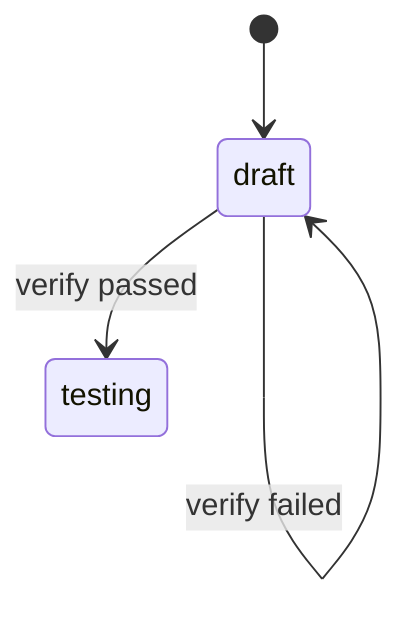
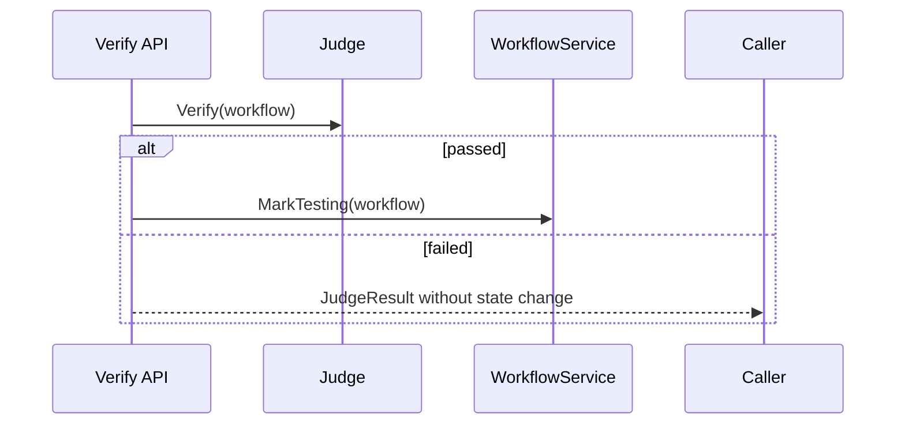
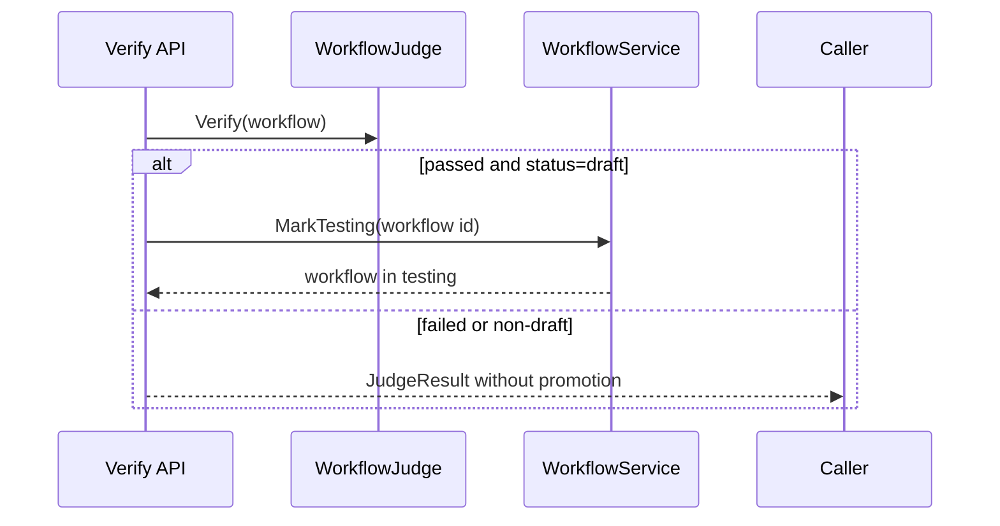

# Task F5.8 - Draft to Testing on Verify Pass

**Status**: Completed
**Phase**: AGENT_SPEC - Fase 5 Judge y activacion
**Depends on**: F2.4, F5.7
**Required by**: F5.9

---

## Objective

Implementar la transicion `draft -> testing` cuando `verify` pasa.

---

## Scope

1. aplicar cambio de estado tras verify exitoso
2. preservar `draft` si hay violations
3. no forzar activacion
4. mantener trazabilidad clara del lifecycle

---

## Out of Scope

- activate
- archive de versiones previas

---

## Acceptance Criteria

- verify exitoso mueve el workflow a `testing`
- verify con violations no cambia a `testing`
- transicion reutiliza lifecycle de workflow ya existente

---

## Diagram



## Quality Gates

```powershell
go test ./internal/domain/workflow/...
go test ./internal/api/handlers/... ./internal/api/middleware/...
```

## References

- `docs/agent-spec-phase5-analysis.md`
- `docs/agent-spec-design.md`

## Sources of Truth

- `docs/agent-spec-overview.md`
- `docs/agent-spec-development-plan.md`
- `docs/agent-spec-design.md`
- `docs/agent-spec-use-cases.md`
- `docs/agent-spec-traceability.md`
- `docs/agent-spec-phase5-analysis.md`

## Planned Diagram



## Planned Deliverable

- verify flow promotes draft to testing only on pass
- tests for pass/fail state transitions

## Implementation References

- `internal/domain/workflow/`
- `internal/api/handlers/`
- `internal/api/handlers/workflow.go`
- `internal/api/handlers/workflow_test.go`

## Verification Evidence

- `go test ./internal/domain/workflow/...`
- `go test ./internal/api/handlers/... ./internal/api/middleware/...`

## Implemented Diagram



## Implemented

- verify endpoint now promotes workflows from `draft` to `testing` when verification passes
- promotion reuses `WorkflowService.MarkTesting(...)`
- failed verification keeps workflow in `draft`
- verify on non-draft workflows does not auto-promote or mutate status
