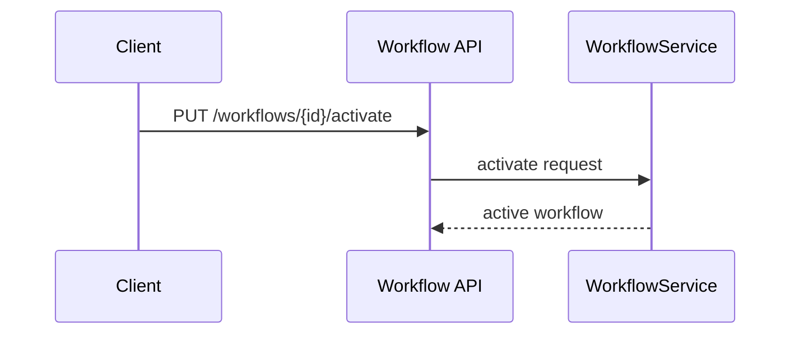
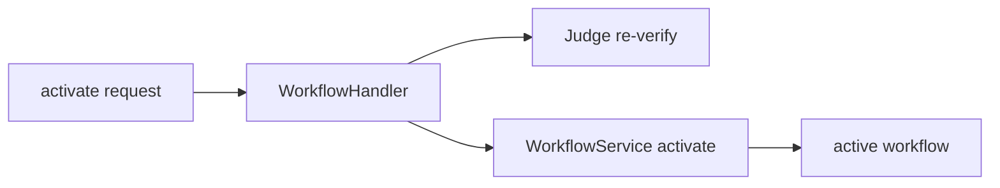
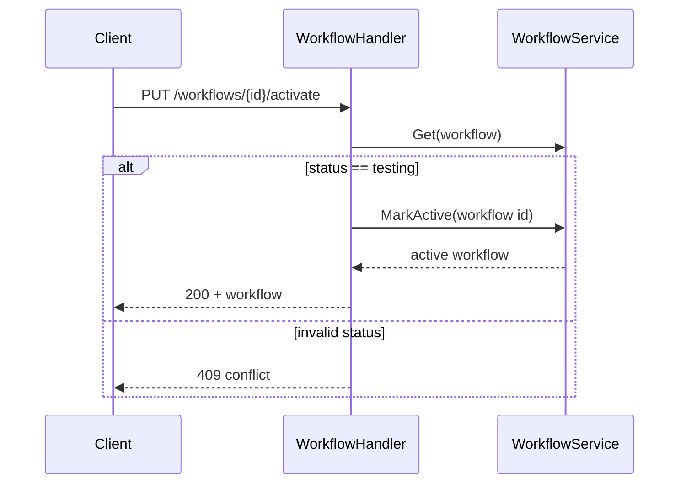

# Task F5.9 - Activate Workflow Endpoint

**Status**: Completed
**Phase**: AGENT_SPEC - Fase 5 Judge y activacion
**Depends on**: F2.4, F5.7, F5.8
**Required by**: F5.10, F5.11, F7.6

---

## Objective

Implementar `PUT /api/v1/workflows/{id}/activate`.

---

## Scope

1. exponer activate por API
2. aceptar solo workflows en `testing`
3. delegar promotion al service
4. devolver workflow activo resultante

---

## Out of Scope

- scheduler
- rollout progresivo

---

## Acceptance Criteria

- existe endpoint de activate
- rechaza estados no validos
- prepara el flujo para re-verify y archive de versiones previas

---

## Diagram



## Quality Gates

```powershell
go test ./internal/api/handlers/... ./internal/api/middleware/...
go test ./internal/domain/workflow/...
```

## References

- `docs/agent-spec-phase5-analysis.md`
- `docs/agent-spec-design.md`

## Sources of Truth

- `docs/agent-spec-overview.md`
- `docs/agent-spec-development-plan.md`
- `docs/agent-spec-design.md`
- `docs/agent-spec-use-cases.md`
- `docs/agent-spec-traceability.md`
- `docs/agent-spec-phase5-analysis.md`

## Planned Diagram



## Planned Deliverable

- activate endpoint wired to workflow lifecycle
- tests for state preconditions

## Implementation References

- `internal/api/handlers/`
- `internal/domain/workflow/`
- `internal/api/handlers/workflow.go`
- `internal/api/handlers/workflow_test.go`
- `internal/api/routes.go`

## Verification Evidence

- `go test ./internal/api/handlers/... ./internal/api/middleware/...`
- `go test ./internal/domain/workflow/...`

## Implemented Diagram



## Implemented

- endpoint `PUT /api/v1/workflows/{id}/activate`
- current activation path requires `status=testing`
- activation delegates to `WorkflowService.MarkActive(...)`
- non-testing workflows are rejected with `409`
- this slice intentionally does not re-verify yet; that remains in `F5.10`
