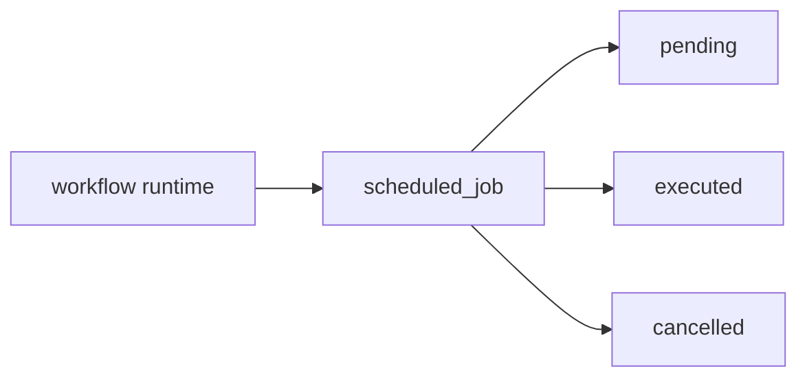
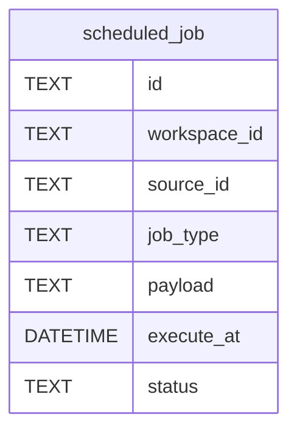
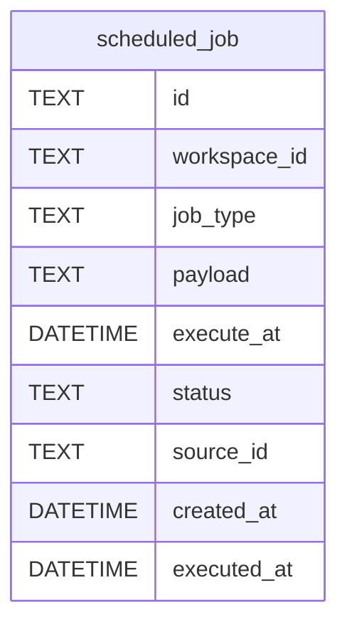

# Task F6.1 - scheduled_job Migration

**Status**: Completed
**Phase**: AGENT_SPEC - Fase 6 Scheduler y WAIT
**Depends on**: F2.4
**Required by**: F6.2, F6.3, F6.5

---

## Objective

Crear la migracion de tabla `scheduled_job`.

---

## Scope

1. tabla persistente para jobs diferidos
2. `job_type=workflow_resume`
3. estados `pending`, `executed`, `cancelled`
4. indices para due jobs y cancelacion por source

---

## Out of Scope

- worker de polling
- resume handler
- parser `WAIT`

---

## Acceptance Criteria

- existe tabla `scheduled_job`
- soporta payload de resume persistido
- soporta cancelacion por `source_id`
- soporta query eficiente de jobs pendientes por `execute_at`

---

## Diagram



## Quality Gates

```powershell
go test ./internal/infra/sqlite/...
```

## References

- `docs/agent-spec-phase6-analysis.md`
- `docs/agent-spec-design.md`

## Sources of Truth

- `docs/agent-spec-overview.md`
- `docs/agent-spec-development-plan.md`
- `docs/agent-spec-design.md`
- `docs/agent-spec-use-cases.md`
- `docs/agent-spec-traceability.md`
- `docs/agent-spec-phase6-analysis.md`

## Planned Diagram



## Planned Deliverable

- SQLite migration for `scheduled_job`
- migration test coverage

## Implementation References

- `internal/infra/sqlite/migrations/`
- `internal/infra/sqlite/migrate_test.go`

## Verification Evidence

- `go test ./internal/infra/sqlite/...`

## Implemented Diagram



## Implemented

- SQLite migration `027_scheduled_jobs`
- table `scheduled_job` with:
  - `job_type=workflow_resume`
  - `status=pending|executed|cancelled`
  - `payload` JSON
  - `source_id` for later cancellation by source/workflow
- indexes for due-job lookup and source-based cancellation
- migration tests for:
  - table creation
  - status check
  - job type check
  - workspace FK enforcement
