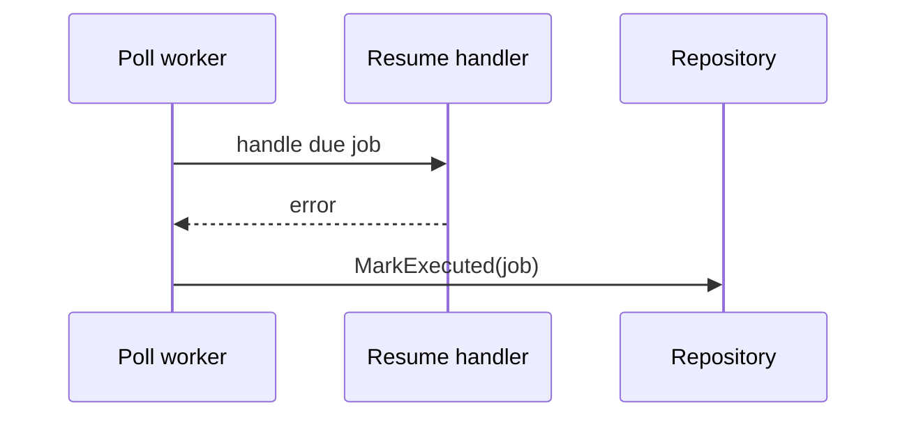

# Task F6.10 - No Automatic Retry on Failed Resume

**Status**: Completed
**Phase**: AGENT_SPEC - Fase 6 Scheduler y WAIT
**Depends on**: F6.6
**Required by**: F6.11

---

## Objective

Marcar jobs como ejecutados sin retry automatico ante fallo de resume.

---

## Scope

1. politica explicita de no retry
2. `scheduled_job` pasa a `executed` aunque falle el handler
3. error visible en run/audit

---

## Out of Scope

- retry manual por UI
- backoff
- compensacion automatica

---

## Acceptance Criteria

- no existe retry automatico de resumes fallidos
- el job no queda en `pending` tras un fallo de resume
- el fallo queda trazable

---

## Diagram


## Quality Gates

```powershell
go test ./internal/domain/agent/...
go test ./internal/domain/workflow/...
```

## References

- `docs/agent-spec-phase6-analysis.md`
- `docs/agent-spec-design.md`

## Sources of Truth

- `docs/agent-spec-overview.md`
- `docs/agent-spec-development-plan.md`
- `docs/agent-spec-design.md`
- `docs/agent-spec-use-cases.md`
- `docs/agent-spec-traceability.md`
- `docs/agent-spec-phase6-analysis.md`

## Implemented

- `Worker.RunCycle()` ahora marca cada due job como `executed` despues del intento
- si el `ResumeHandler` falla, el worker sigue devolviendo error para observabilidad
- el job no queda en `pending`, por lo tanto no hay retry automatico en ciclos posteriores
- la trazabilidad del fallo queda en el `agent_run` via `WorkflowResumeHandler`/`DSLRunner.Resume`

## Implemented Diagram



## Planned Deliverable

- failure policy without automatic retry
- tests for failed resume semantics

## Implementation References

- `internal/domain/scheduler/worker.go`
- `internal/domain/scheduler/worker_test.go`
- `internal/domain/agent/workflow_resume_handler.go`
- `internal/domain/agent/dsl_runner.go`

## Verification Evidence

- `go test ./internal/domain/scheduler/... ./internal/domain/agent/... ./internal/domain/workflow/...`
