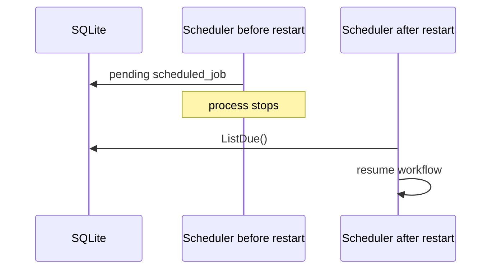

# Task F6.11 - Restart Recovery

**Status**: Completed
**Phase**: AGENT_SPEC - Fase 6 Scheduler y WAIT
**Depends on**: F6.2, F6.5, F6.6, F6.7, F6.8, F6.10
**Required by**: F6.12

---

## Objective

Probar recovery tras reinicio.

---

## Scope

1. jobs pendientes sobreviven restart
2. worker retoma jobs due tras reinicio
3. no duplicacion de resume

---

## Out of Scope

- election distribuida
- multi-node scheduler
- retry automatico

---

## Acceptance Criteria

- un job pendiente antes del restart puede ser retomado despues
- el recovery no ejecuta dos veces el mismo resume
- el handler sigue respetando archive y no-retry

---

## Diagram



## Quality Gates

```powershell
go test ./internal/domain/agent/...
go test ./internal/infra/sqlite/...
```

## References

- `docs/agent-spec-phase6-analysis.md`
- `docs/agent-spec-design.md`

## Sources of Truth

- `docs/agent-spec-overview.md`
- `docs/agent-spec-development-plan.md`
- `docs/agent-spec-design.md`
- `docs/agent-spec-use-cases.md`
- `docs/agent-spec-traceability.md`
- `docs/agent-spec-phase6-analysis.md`

## Implemented

- recovery se valida con `scheduled_job` real persistido en SQLite
- un worker nuevo tras "restart" consume el job `pending` y ejecuta el resume
- el job queda `executed`, por lo que un segundo worker tras otro restart no vuelve a ejecutarlo
- el flujo sigue respetando el handler real de resume y las reglas de archive/no-retry

## Implemented Diagram


## Planned Deliverable

- recovery tests covering restart and later resume

## Implementation References

- `internal/domain/agent/workflow_resume_recovery_test.go`
- `internal/domain/agent/workflow_resume_handler.go`
- `internal/domain/scheduler/worker.go`
- `internal/domain/scheduler/repository.go`

## Verification Evidence

- `go test ./internal/domain/agent/... ./internal/domain/scheduler/... ./internal/infra/sqlite/...`
