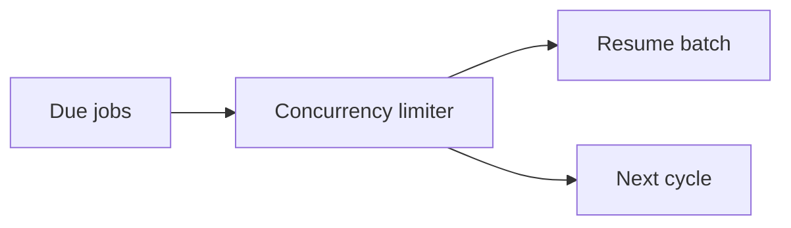
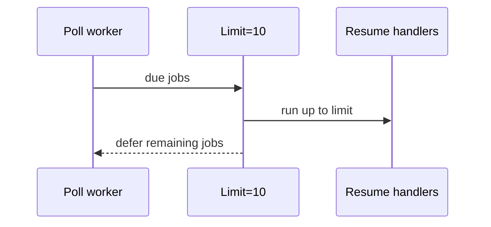
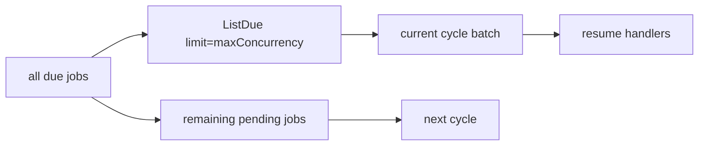

# Task F6.12 - Bounded Resume Concurrency

**Status**: Completed
**Phase**: AGENT_SPEC - Fase 6 Scheduler y WAIT
**Depends on**: F6.5, F6.11
**Required by**: none

---

## Objective

Probar y cerrar concurrencia limitada de resumes.

---

## Scope

1. limite de resumes concurrentes por ciclo
2. drenado progresivo de jobs due
3. proteccion frente a picos de carga

---

## Out of Scope

- autoscaling
- multi-node coordination
- rate limiting externo

---

## Acceptance Criteria

- la concurrencia de resumes queda acotada
- jobs due adicionales esperan otro ciclo o slot libre
- el scheduler no intenta ejecutar todos los due jobs a la vez

---

## Diagram



## Quality Gates

```powershell
go test ./internal/domain/agent/...
go test ./internal/infra/sqlite/...
```

## References

- `docs/agent-spec-phase6-analysis.md`
- `docs/agent-spec-design.md`

## Sources of Truth

- `docs/agent-spec-overview.md`
- `docs/agent-spec-development-plan.md`
- `docs/agent-spec-design.md`
- `docs/agent-spec-use-cases.md`
- `docs/agent-spec-traceability.md`
- `docs/agent-spec-phase6-analysis.md`

## Planned Diagram



## Implemented

- `Worker.RunCycle()` ya limita cada ciclo a `maxConcurrency` usando `ListDue(..., limit)` y un semaforo interno
- jobs due por encima del limite no se ejecutan en el mismo ciclo; quedan `pending` y drenan en ciclos posteriores
- la evidencia cubre tanto el pico concurrente maximo como el vaciado progresivo de la cola en multiples ciclos
- los tests del worker quedaron estabilizados con SQLite `:memory:` fijado a una sola conexion para no falsear resultados concurrentes

## Implemented Diagram



## Planned Deliverable

- bounded concurrency mechanism
- stress-oriented tests for due-job bursts

## Implementation References

- `internal/domain/scheduler/worker.go`
- `internal/domain/scheduler/worker_test.go`
- `internal/domain/scheduler/repository_test.go`

## Verification Evidence

- `go test ./internal/domain/scheduler/... ./internal/domain/agent/... ./internal/infra/sqlite/...`
