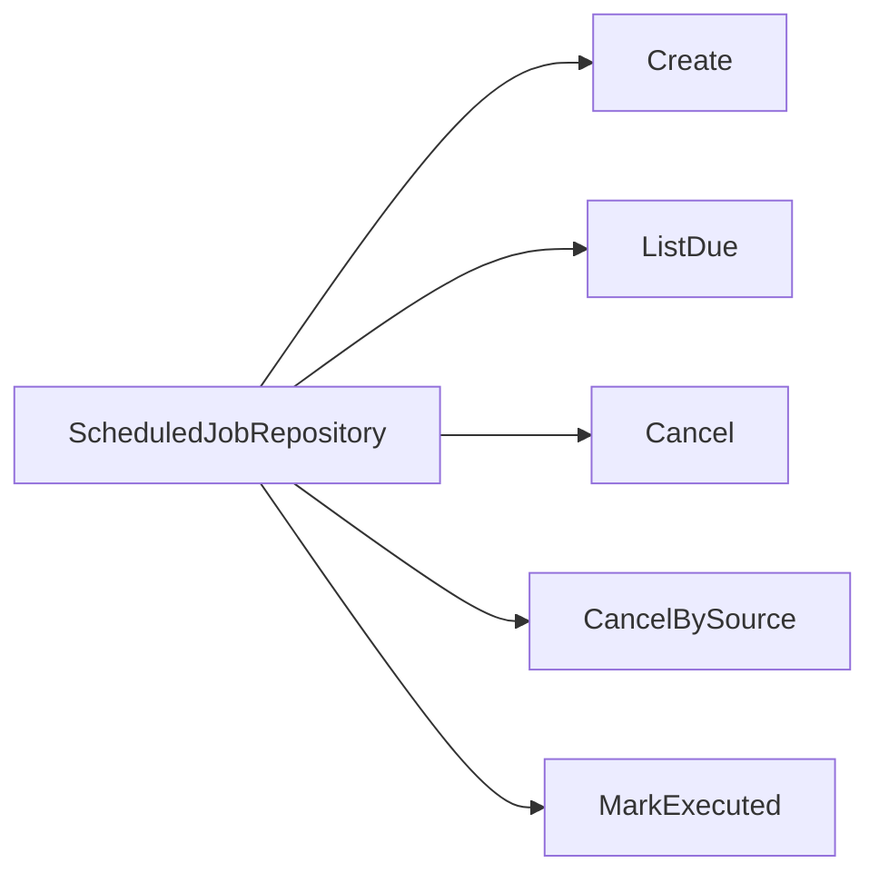
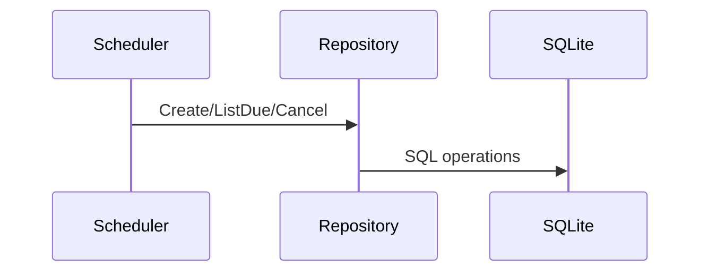
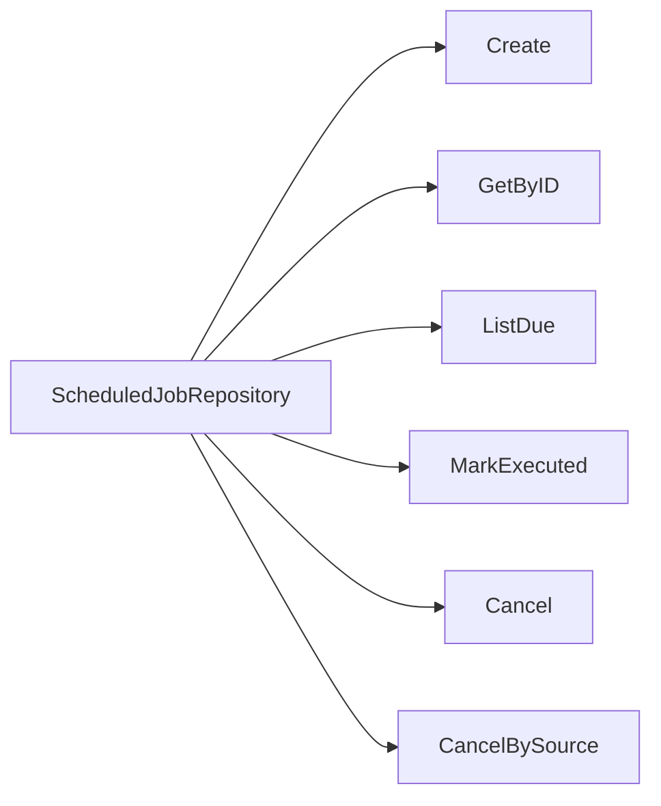

# Task F6.2 - Scheduled Job Repository

**Status**: Completed
**Phase**: AGENT_SPEC - Fase 6 Scheduler y WAIT
**Depends on**: F6.1
**Required by**: F6.3, F6.4, F6.5, F6.11

---

## Objective

Implementar el repositorio de jobs programados.

---

## Scope

1. modelo `ScheduledJob`
2. `Create`
3. `GetByID`
4. `ListDue`
5. `MarkExecuted`
6. `Cancel`
7. `CancelBySource`

---

## Out of Scope

- scheduler service
- polling worker
- runtime `WAIT`

---

## Acceptance Criteria

- el repositorio persiste y recupera jobs programados
- los estados del job son explicitos y consistentes
- `ListDue` soporta limite y orden por `execute_at`
- `CancelBySource` es idempotente

---

## Diagram



## Quality Gates

```powershell
go test ./internal/domain/... ./internal/infra/sqlite/...
```

## References

- `docs/agent-spec-phase6-analysis.md`
- `docs/agent-spec-design.md`

## Sources of Truth

- `docs/agent-spec-overview.md`
- `docs/agent-spec-development-plan.md`
- `docs/agent-spec-design.md`
- `docs/agent-spec-use-cases.md`
- `docs/agent-spec-traceability.md`
- `docs/agent-spec-phase6-analysis.md`

## Planned Diagram



## Planned Deliverable

- scheduled job repository
- repository tests for create, due lookup, execute, cancel

## Implementation References

- `internal/domain/`
- `internal/infra/sqlite/queries/`

## Verification Evidence

- `go test ./internal/domain/...`
- `go test ./internal/infra/sqlite/...`

## Implemented Diagram



## Implemented

- paquete `internal/domain/scheduler`
- entidad `ScheduledJob`
- `Repository` con:
  - `Create`
  - `GetByID`
  - `ListDue`
  - `MarkExecuted`
  - `Cancel`
  - `CancelBySource`
- errores explicitos:
  - `ErrScheduledJobNotFound`
- orden estable en `ListDue` por `execute_at`, `created_at`
- tests para create/get, due query, executed transition y cancellation
