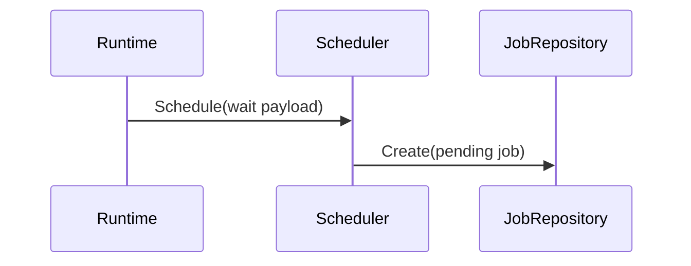
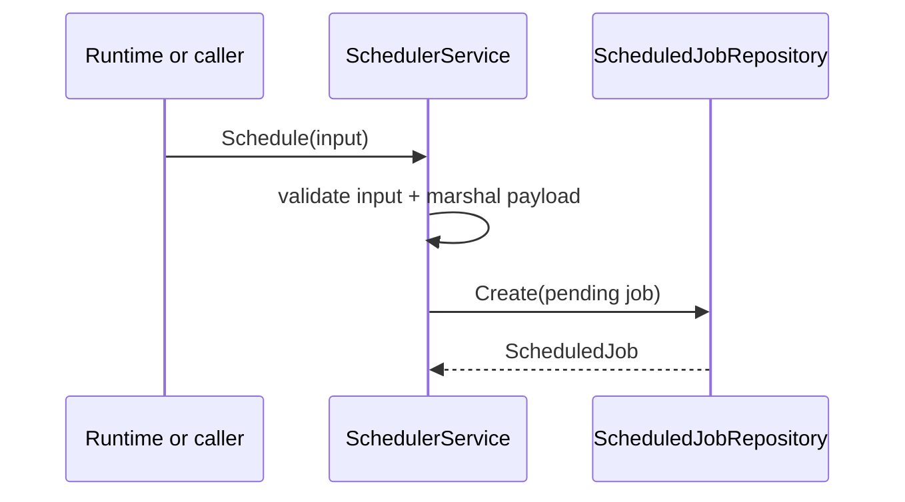

# Task F6.3 - Scheduler Schedule

**Status**: Completed
**Phase**: AGENT_SPEC - Fase 6 Scheduler y WAIT
**Depends on**: F6.1, F6.2
**Required by**: F6.6, F6.8

---

## Objective

Implementar `Scheduler.Schedule`.

---

## Scope

1. contrato `Scheduler`
2. `Schedule(ctx, input)`
3. persistencia de job `workflow_resume`
4. soporte de `WAIT 0` como yield

---

## Out of Scope

- cancelacion
- worker de polling
- parser `WAIT`

---

## Acceptance Criteria

- `Schedule` crea un job pendiente persistido
- `execute_at` queda correctamente calculado
- devuelve identidad del job programado
- soporta `WAIT 0` sin branch especial externo

---

## Diagram



## Quality Gates

```powershell
go test ./internal/domain/...
go test ./internal/infra/sqlite/...
```

## References

- `docs/agent-spec-phase6-analysis.md`
- `docs/agent-spec-design.md`

## Sources of Truth

- `docs/agent-spec-overview.md`
- `docs/agent-spec-development-plan.md`
- `docs/agent-spec-design.md`
- `docs/agent-spec-use-cases.md`
- `docs/agent-spec-traceability.md`
- `docs/agent-spec-phase6-analysis.md`

## Planned Diagram


## Planned Deliverable

- scheduler service with `Schedule`
- schedule tests, including zero-delay yield

## Implementation References

- `internal/domain/`
- `internal/domain/agent/`

## Verification Evidence

- `go test ./internal/domain/...`
- `go test ./internal/infra/sqlite/...`

## Implemented Diagram



## Implemented

- `ScheduleJobInput`
- scheduler service over repository
- `Schedule(...)` with:
  - input validation
  - payload JSON serialization
  - persisted `pending` jobs
  - default `ExecuteAt=now` when zero, covering yield semantics for `WAIT 0`
- tests for:
  - normal scheduling
  - zero-time yield
  - invalid input
