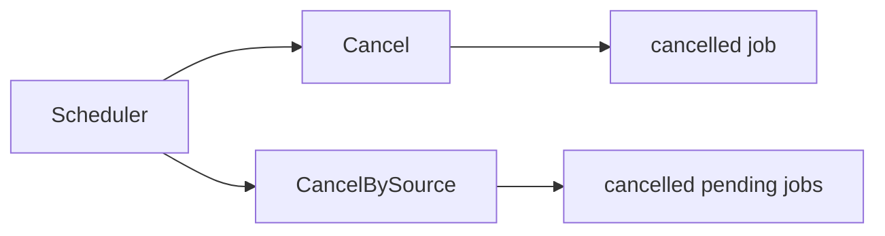
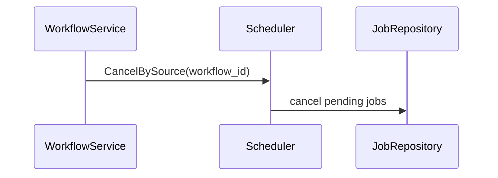
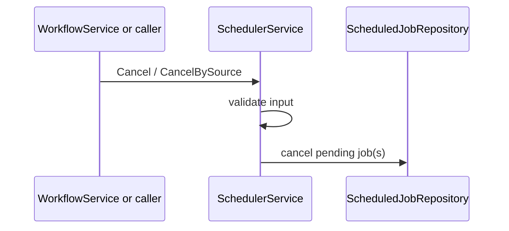

# Task F6.4 - Scheduler Cancel APIs

**Status**: Completed
**Phase**: AGENT_SPEC - Fase 6 Scheduler y WAIT
**Depends on**: F6.2
**Required by**: F6.9

---

## Objective

Implementar `Scheduler.Cancel` y `CancelBySource`.

---

## Scope

1. cancelar job individual
2. cancelar jobs pendientes por source/workflow
3. mantener semantica idempotente

---

## Out of Scope

- polling worker
- parser `WAIT`
- archive flow

---

## Acceptance Criteria

- solo jobs `pending` pasan a `cancelled`
- `executed` no vuelve atras
- `CancelBySource` permite cancelar todos los jobs de un workflow

---

## Diagram



## Quality Gates

```powershell
go test ./internal/domain/... ./internal/infra/sqlite/...
```

## References

- `docs/agent-spec-phase6-analysis.md`
- `docs/agent-spec-design.md`

## Sources of Truth

- `docs/agent-spec-overview.md`
- `docs/agent-spec-development-plan.md`
- `docs/agent-spec-design.md`
- `docs/agent-spec-use-cases.md`
- `docs/agent-spec-traceability.md`
- `docs/agent-spec-phase6-analysis.md`

## Planned Diagram



## Planned Deliverable

- cancel APIs in scheduler
- tests for single and bulk cancellation

## Implementation References

- `internal/domain/`
- `internal/infra/sqlite/`

## Verification Evidence

- `go test ./internal/domain/...`
- `go test ./internal/infra/sqlite/...`

## Implemented Diagram



## Implemented

- `Scheduler.Cancel(...)`
- `Scheduler.CancelBySource(...)`
- input validation for:
  - `workspace_id`
  - `job_id`
  - `source_id`
- tests for:
  - single pending cancellation
  - bulk cancellation by source
  - invalid input rejection
