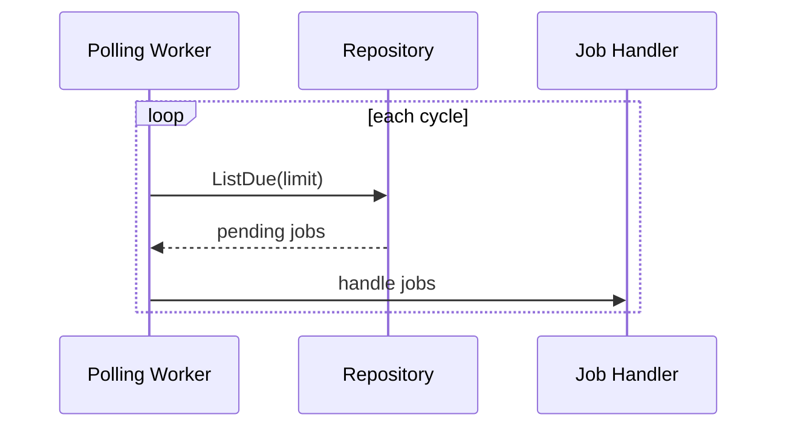
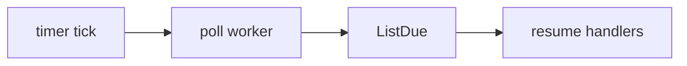
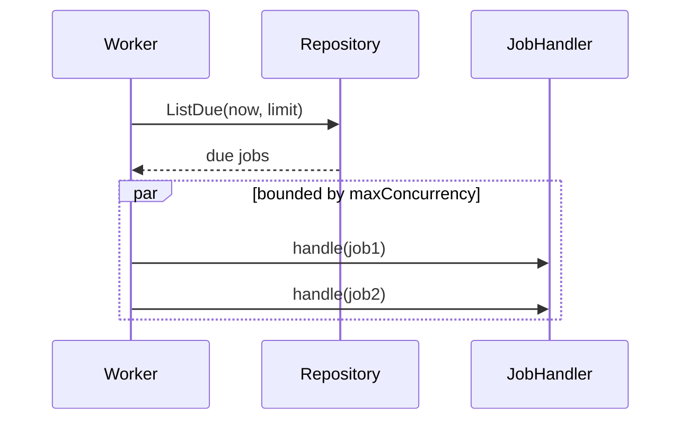

# Task F6.5 - Polling Worker for Due Jobs

**Status**: Completed
**Phase**: AGENT_SPEC - Fase 6 Scheduler y WAIT
**Depends on**: F6.2
**Required by**: F6.6, F6.11, F6.12

---

## Objective

Crear la goroutine de polling para jobs pendientes.

---

## Scope

1. loop de polling
2. consulta de jobs due
3. dispatch a handler de job
4. limite de concurrencia por ciclo

---

## Out of Scope

- handler de resume
- parser `WAIT`
- UI o observabilidad avanzada

---

## Acceptance Criteria

- el worker detecta jobs due en ciclos de polling
- el worker limita resumes concurrentes
- el worker no depende de memoria volatile para descubrir jobs

---

## Diagram



## Quality Gates

```powershell
go test ./internal/domain/... ./internal/infra/sqlite/...
```

## References

- `docs/agent-spec-phase6-analysis.md`
- `docs/agent-spec-design.md`

## Sources of Truth

- `docs/agent-spec-overview.md`
- `docs/agent-spec-development-plan.md`
- `docs/agent-spec-design.md`
- `docs/agent-spec-use-cases.md`
- `docs/agent-spec-traceability.md`
- `docs/agent-spec-phase6-analysis.md`

## Planned Diagram



## Planned Deliverable

- polling worker
- tests for due-job scanning and concurrency cap

## Implementation References

- `internal/domain/`

## Verification Evidence

- `go test ./internal/domain/...`

## Implemented Diagram



## Implemented

- `Worker` with:
  - `Start(ctx)`
  - `RunCycle(ctx)`
- injected dependencies:
  - repository
  - `JobHandler`
  - clock and sleep hooks for tests
- bounded concurrency per cycle via `maxConcurrency`
- tests for:
  - processing only due jobs
  - respecting concurrency limit
  - propagating handler error
  - missing dependency guards
