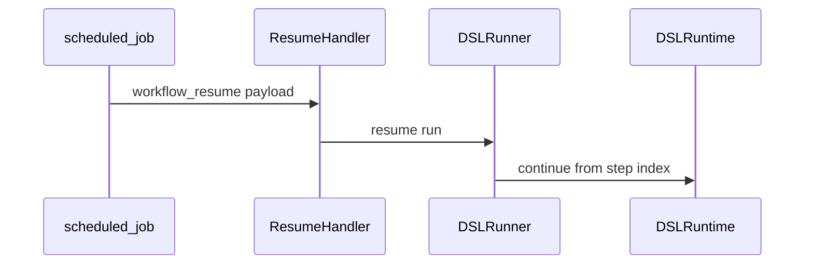
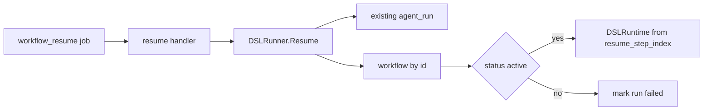

# Task F6.6 - Workflow Resume Handler

**Status**: Completed
**Phase**: AGENT_SPEC - Fase 6 Scheduler y WAIT
**Depends on**: F4.11, F6.3, F6.5
**Required by**: F6.10, F6.11

---

## Objective

Implementar el handler de resume de workflows.

---

## Scope

1. handler de `workflow_resume`
2. carga de workflow y run
3. resume desde `resume_step_index`
4. defensa frente a workflow archivado

---

## Out of Scope

- retries automaticos
- `DISPATCH`
- UI de jobs

---

## Acceptance Criteria

- existe un handler para jobs `workflow_resume`
- el resume reingresa al runtime DSL
- workflow archivado bloquea el resume
- el resultado queda reflejado en `agent_run`

---

## Diagram



## Quality Gates

```powershell
go test ./internal/domain/agent/...
go test ./internal/domain/workflow/...
```

## References

- `docs/agent-spec-phase6-analysis.md`
- `docs/agent-spec-design.md`

## Sources of Truth

- `docs/agent-spec-overview.md`
- `docs/agent-spec-development-plan.md`
- `docs/agent-spec-design.md`
- `docs/agent-spec-use-cases.md`
- `docs/agent-spec-traceability.md`
- `docs/agent-spec-phase6-analysis.md`

## Implemented

- `WorkflowResumeHandler` consumes `scheduled_job` payloads of type `workflow_resume`
- `DSLRunner.Resume(...)` reloads the existing `agent_run` and the exact workflow version
- resume re-enters `DSLRuntime` from `resume_step_index`
- archived or inactive workflows fail closed and persist the failure into the same `agent_run`

## Implemented Diagram



## Planned Deliverable

- resume handler integrated with DSL runner/runtime
- tests for successful and blocked resume

## Implementation References

- `internal/domain/agent/dsl_runtime.go`
- `internal/domain/agent/dsl_runner.go`
- `internal/domain/agent/workflow_resume_handler.go`
- `internal/domain/agent/workflow_resume_handler_test.go`

## Verification Evidence

- `go test ./internal/domain/agent/...`
- `go test ./internal/domain/workflow/...`
