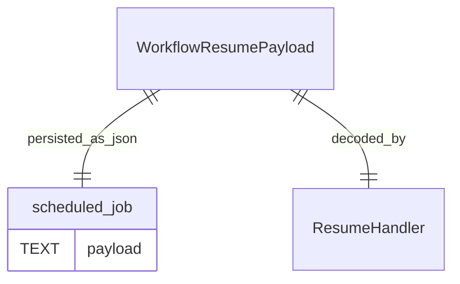

# Task F6.7 - Persist Resume State

**Status**: Completed
**Phase**: AGENT_SPEC - Fase 6 Scheduler y WAIT
**Depends on**: F6.1, F6.6
**Required by**: F6.8, F6.11

---

## Objective

Persistir el estado minimo necesario para reanudar una ejecucion.

---

## Scope

1. payload con `workflow_id`
2. payload con `run_id`
3. payload con `resume_step_index`
4. forma estable de reconstruir el resume

---

## Out of Scope

- snapshots completos de entidad
- retries
- estado de delegacion externa

---

## Acceptance Criteria

- el payload de resume es persistido junto al job
- el runtime puede reanudar desde el paso siguiente al `WAIT`
- no depende de estado transitorio en memoria

---

## Diagram


## Quality Gates

```powershell
go test ./internal/domain/agent/...
go test ./internal/infra/sqlite/...
```

## References

- `docs/agent-spec-phase6-analysis.md`
- `docs/agent-spec-design.md`

## Sources of Truth

- `docs/agent-spec-overview.md`
- `docs/agent-spec-development-plan.md`
- `docs/agent-spec-design.md`
- `docs/agent-spec-use-cases.md`
- `docs/agent-spec-traceability.md`
- `docs/agent-spec-phase6-analysis.md`

## Implemented

- `WorkflowResumePayload` define el shape canonico persistible de resume
- `EncodeWorkflowResumePayload(...)` y `DecodeWorkflowResumePayload(...)` garantizan round-trip estable
- `Scheduler.Schedule(...)` valida y normaliza payloads de `workflow_resume` antes de persistirlos
- `WorkflowResumeHandler` y `DSLRunner.Resume(...)` consumen el mismo contrato, sin shape duplicado

## Implemented Diagram



## Planned Deliverable

- persisted resume payload format
- tests for payload storage and later reconstruction

## Implementation References

- `internal/domain/scheduler/payload.go`
- `internal/domain/scheduler/payload_test.go`
- `internal/domain/scheduler/service.go`
- `internal/domain/scheduler/service_test.go`
- `internal/domain/agent/workflow_resume_handler.go`
- `internal/domain/agent/dsl_runner.go`

## Verification Evidence

- `go test ./internal/domain/scheduler/... ./internal/domain/agent/... ./internal/infra/sqlite/...`
