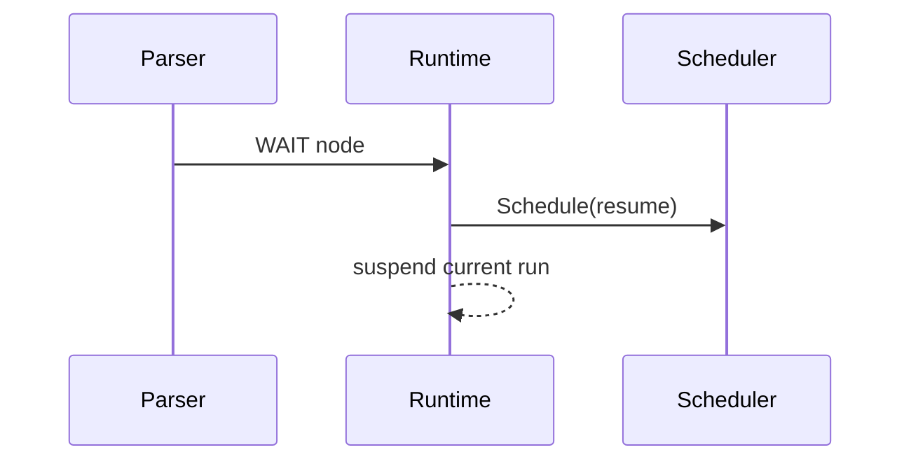
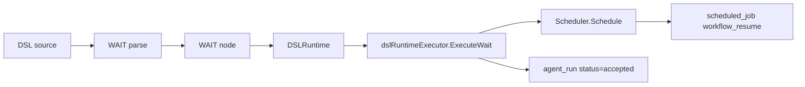

# Task F6.8 - WAIT in Parser and Runtime

**Status**: Completed
**Phase**: AGENT_SPEC - Fase 6 Scheduler y WAIT
**Depends on**: F4.10, F6.3, F6.7
**Required by**: F6.11, F7.2

---

## Objective

Implementar `WAIT` en parser y runtime.

---

## Scope

1. parser de `WAIT <duration>`
2. AST/runtime para `WAIT`
3. scheduling del resume
4. suspension de la ejecucion actual

---

## Out of Scope

- scheduler distribuido
- `DISPATCH`
- retry automatico

---

## Acceptance Criteria

- `WAIT` deja de ser verbo reservado/rechazado
- `WAIT` programa un `workflow_resume`
- la ejecucion se reanuda desde el paso siguiente
- duracion negativa es error de validacion

---

## Diagram



## Quality Gates

```powershell
go test ./internal/domain/agent/...
go test ./internal/domain/workflow/...
```

## References

- `docs/agent-spec-phase6-analysis.md`
- `docs/agent-spec-design.md`

## Sources of Truth

- `docs/agent-spec-overview.md`
- `docs/agent-spec-development-plan.md`
- `docs/agent-spec-design.md`
- `docs/agent-spec-use-cases.md`
- `docs/agent-spec-traceability.md`
- `docs/agent-spec-phase6-analysis.md`

## Implemented

- `WAIT` ya es statement ejecutable del DSL
- parser soporta `WAIT 0` y `WAIT <signed_integer> <unit>`
- validacion DSL rechaza duraciones negativas y unidades invalidas
- runtime agenda `workflow_resume` con `resume_step_index` y corta la ejecucion actual
- `DSLRunner` deja el `agent_run` en `accepted` mientras espera el resume

## Implemented Diagram



## Planned Deliverable

- parser and runtime support for `WAIT`
- tests for valid, zero and invalid durations

## Implementation References

- `internal/domain/agent/token.go`
- `internal/domain/agent/ast.go`
- `internal/domain/agent/parser.go`
- `internal/domain/agent/dsl_validation.go`
- `internal/domain/agent/dsl_runtime.go`
- `internal/domain/agent/dsl_runtime_executor.go`
- `internal/domain/agent/dsl_runner.go`
- `internal/domain/agent/dsl_runtime_test.go`
- `internal/domain/agent/dsl_runtime_executor_test.go`
- `internal/domain/agent/dsl_runner_test.go`

## Verification Evidence

- `go test ./internal/domain/agent/... ./internal/domain/scheduler/... ./internal/domain/workflow/...`
