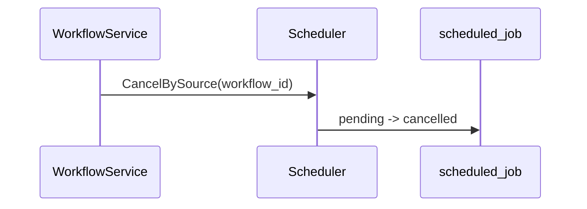
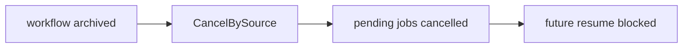

# Task F6.9 - Cancel Jobs on Workflow Archive

**Status**: Completed
**Phase**: AGENT_SPEC - Fase 6 Scheduler y WAIT
**Depends on**: F2.4, F6.4, F5.11
**Required by**: none

---

## Objective

Cancelar jobs pendientes al archivar workflows.

---

## Scope

1. hook en archive flow
2. cancelacion por source/workflow
3. bloqueo de resumes posteriores

---

## Out of Scope

- rollback automatico
- UI de jobs
- retries

---

## Acceptance Criteria

- archivar un workflow cancela sus jobs pendientes
- jobs cancelados no se reanudan luego
- la cancelacion es consistente con el lifecycle de workflow

---

## Diagram



## Quality Gates

```powershell
go test ./internal/domain/workflow/...
go test ./internal/domain/agent/...
```

## References

- `docs/agent-spec-phase6-analysis.md`
- `docs/agent-spec-design.md`

## Sources of Truth

- `docs/agent-spec-overview.md`
- `docs/agent-spec-development-plan.md`
- `docs/agent-spec-design.md`
- `docs/agent-spec-use-cases.md`
- `docs/agent-spec-traceability.md`
- `docs/agent-spec-phase6-analysis.md`

## Implemented

- `WorkflowService.SetStatus(..., StatusArchived)` ahora dispara `CancelBySource(workflow_id)`
- la cancelacion corre solo cuando el cambio a `archived` fue persistido correctamente
- el hook es opcional: sin scheduler configurado el lifecycle sigue funcionando
- los jobs pendientes del workflow ya no aparecen como due tras archivar

## Implemented Diagram



## Planned Deliverable

- archive integration with scheduler cancellation
- tests for archive-driven cancellation

## Implementation References

- `internal/domain/workflow/service.go`
- `internal/domain/workflow/service_test.go`
- `internal/domain/scheduler/service.go`
- `internal/domain/scheduler/repository.go`

## Verification Evidence

- `go test ./internal/domain/workflow/... ./internal/domain/scheduler/... ./internal/domain/agent/...`
