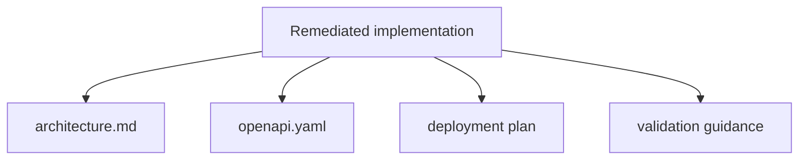

# Task Mobile/BFF Remediation 5 - Documentation And Validation Alignment

**Status**: Completed
**Phase**: Mobile/BFF/API Audit And Remediation
**Depends on**: Mobile/BFF Remediation 2, 3, 4
**Required by**: —

---

## Objective

Align formal documentation and validation assets with the remediated mobile/BFF
 contract so the deployed system can be understood without reading the code.

## Completion Notes

- `docs/architecture.md` now describes the BFF as a minimal mobile gateway and
  removes the retired custom aggregated `/:id/full` routes from the documented
  public contract.
- `docs/openapi.yaml` now includes `/readyz`, `signals`, `workflows`, and
  `agents/runs` paths used by the remediated mobile/backend flow.
- Validation for this task remains documentation-focused; broader runtime
  verification is deferred to push/CI per rollout guidance.

---

## Scope

1. Update `docs/architecture.md` to describe the BFF as a minimal mobile
   gateway
2. Update `docs/openapi.yaml` to cover the Go API surface relied on by mobile,
   including:
   - `/readyz`
   - signals
   - workflows
   - agent runs
3. Ensure deployment documentation references the reduced BFF role without
   duplicating the remediation narrative
4. Document final validation commands and smoke coverage for:
   - backend
   - BFF
   - mobile

---

## Out of Scope

- Reintroducing deprecated BFF routes into formal docs
- New product requirements unrelated to mobile/BFF cleanup

---

## Acceptance Criteria

- Architecture, deployment, audit plan, and OpenAPI no longer contradict each
  other
- The final public mobile contract is discoverable from docs
- Removed BFF custom routes are not presented as stable public APIs
- Validation guidance matches the remediated implementation

---

## Execution Order

1. Update `docs/architecture.md` after task 4 lands, not before
2. Update `docs/openapi.yaml` to match the Go contract mobile actually uses
3. Reconcile deployment documentation with the reduced BFF role
4. Record final validation commands and smoke coverage expectations
5. Do a last contradiction pass across all related docs

---

## Technical Dependencies

- `docs/mobile-bff-api-audit-remediation-plan.md`
- `docs/architecture.md`
- `docs/openapi.yaml`
- `docs/deployment-plan-digitalocean.md`
- `docs/mobile-agent-spec-transition-gap-closure-plan.md`
- the final route and behavior state from tasks 2, 3, and 4

---

## Do Not Start Until

- Task 2 has finalized the Go contract shape
- Task 3 has finalized the mobile route usage
- Task 4 has finalized the remaining BFF surface

---

## Risks And Rollout Notes

- Updating docs before the contract is stable will create a second drift cycle
- OpenAPI should describe stable Go APIs, not temporary migration-only BFF
  routes
- Validation commands should reflect the real post-remediation gates, not the
  pre-remediation mix

---

## Done When

- Architecture, deployment, audit, and OpenAPI documents describe the same
  public contract
- Validation guidance matches the remediated code paths
- No retired BFF custom route is left documented as stable

---

## Traceability

| Spec | Reference |
|------|-----------|
| FR-300 | Mobile App |
| FR-301 | BFF Gateway |
| NFR-033 | Backend readiness |

---

## Diagram



---

## Quality Gates

```powershell
go test ./internal/api/...
cd bff && npm test
cd mobile && npm run typecheck
cd mobile && npm test
```

---

## References

- `docs/mobile-bff-api-audit-remediation-plan.md`
- `docs/architecture.md`
- `docs/openapi.yaml`
- `docs/deployment-plan-digitalocean.md`

---

## Sources of Truth

- `docs/mobile-bff-api-audit-remediation-plan.md`
- `docs/requirements.md`
